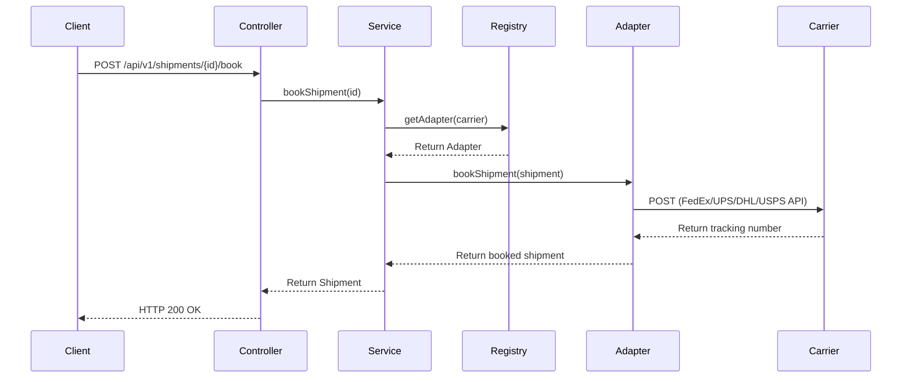
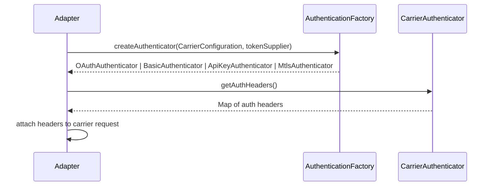
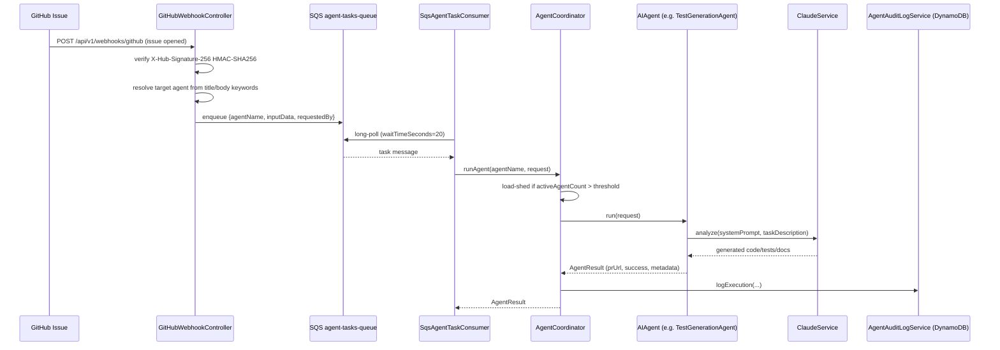

# Atlas Enterprise Platform Architecture

System architecture design and structural layout.

## Sequence Diagram: Booking Flow



## Carrier Authentication Strategy

Carrier adapters (`FedExAdapter`, `UpsAdapter`, `DhlAdapter`, `UspsAdapter`) never resolve credentials
themselves. Each carrier's `CarrierConfiguration` (`authType`: `oauth`, `basic`, `apikey`, or `mtls`)
is passed to `AuthenticationFactory`, which returns the matching `CarrierAuthenticator`:



* **`oauth`** — `OAuthAuthenticator` wraps a `Supplier<String>` token source (see `FedExTokenService`,
  `UpsTokenService`, `UspsTokenService`), which caches and refreshes bearer tokens.
* **`basic`** — `BasicAuthenticator` resolves HTTP Basic credentials from `CarrierConfiguration`.
* **`apikey`** — `ApiKeyAuthenticator` sends the configured `apiKey` under a configurable header
  (defaults to `X-API-KEY`).
* **`mtls`** — `MtlsAuthenticator` signals that authentication is handled at the TLS layer (client
  certificates), contributing no auth headers.

Adapters validate required `CarrierConfiguration` fields up front and throw `CarrierAdapterException`
rather than falling back to blank/dummy credentials.

## AI Agent Layer



* Agents are registered by Spring as `AIAgent` beans and keyed by lowercased simple class name
  (`documentationagent`, `testgenerationagent`, `refactoringagent`, `carrieradapteragent`,
  `securityreviewagent`, `pullrequestagent`).
* Each agent declares a required `ApprovalLevel` (`DOCUMENTATION`, `TESTS`, `FEATURE`, `SECURITY`,
  `ARCHITECTURE`); PRs requiring `SECURITY` or `ARCHITECTURE` approval trigger an SNS notification to
  `agent-review-topic-arn`.
* Messages that fail more than `maxReceiveCount` times are routed to the SQS Dead Letter Queue.
* `AgentCoordinator` rejects synchronous `/api/v1/agents/{name}/execute` calls with `HTTP 429` and
  defers SQS polling while `activeAgentCount` exceeds `app.load-shedding.threshold` (default `5`).

## Component Map

```
io.github.hsummerhays.atlas
├── adapter           FedEx / UPS / DHL / USPS carrier adapters + CarrierRegistry
│   └── auth           CarrierConfiguration, AuthenticationFactory, CarrierAuthenticator impls
├── agent              AIAgent implementations, AgentCoordinator, AgentController, SQS consumer
├── config             AWS, Claude, GitHub, and Spring Security configuration
├── controller         GitHubWebhookController
├── domain
│   ├── model           Canonical Address/Shipment/PackageDetail/Carrier/ShipmentStatus
│   ├── exception        CarrierAdapterException, LoadSheddingException, ShipmentNotFoundException
│   └── repository       ShipmentRepository (JPA)
├── service            ShipmentService, ClaudeService, GitHubIntegrationService, ShipmentEventPublisher
└── web                ShipmentController, GlobalExceptionHandler
```

> This file is also written by `DocumentationAgent` when triggered via a GitHub issue or the
> `/api/v1/agents/documentationagent/execute` endpoint; agent-generated updates go out for human
> review as a Pull Request rather than overwriting `main` directly.
