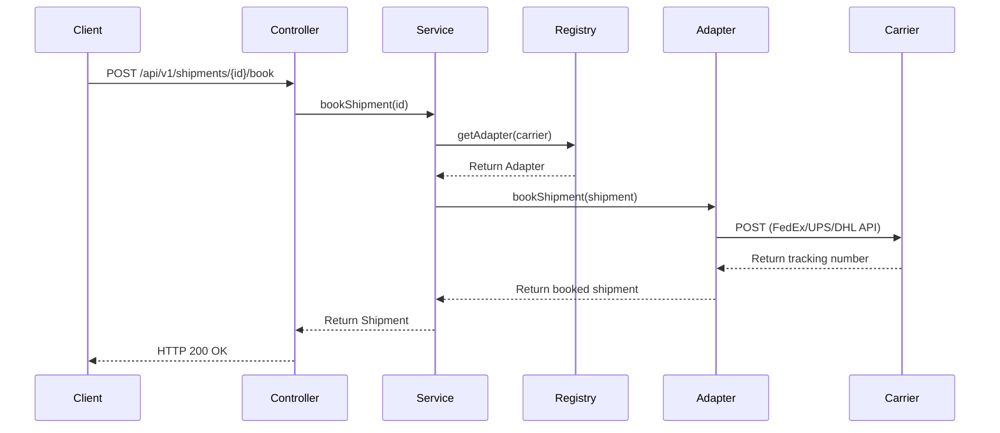

# InXpress Middleware Architecture

System architecture design and structural layout.

## Sequence Diagram: Booking Flow

```mermaid
sequenceDiagram
    participant Client
    participant Controller
    participant Service
    participant Registry
    participant Adapter
    participant Carrier

    Client->>Controller: POST /api/v1/shipments/{id}/book
    Controller->>Service: bookShipment(id)
    Service->>Registry: getAdapter(carrier)
    Registry-->>Service: Return Adapter
    Service->>Adapter: bookShipment(shipment)
    Adapter->>Carrier: POST (FedEx/UPS/DHL API)
    Carrier-->>Adapter: Return tracking number
    Adapter-->>Service: Return booked shipment
    Service-->>Controller: Return Shipment
    Controller-->>Client: HTTP 200 OK
```
